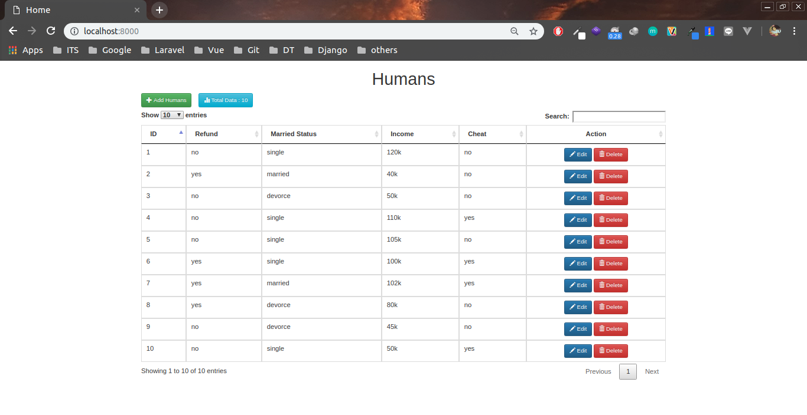

# Apache Cassandra CRUD feat Django

#### 05111540000119 - Cahya Putra Hikmawan
##### https://github.com/cphikmawan/database-distributed-courses

### Outline

#### [1. Vagrant](#1-vagrant-and-apache-cassandra)
#### [2. Virtual Env and Django](#2-virtual-env-and-django)

--------------------------------------

### Prerequisite
| Installed Apps | Version |
| --- | --- |
| OS | Ubuntu 18.04 |
| Vagrant | 18.09.0 |
| Python | 3 |
| PIP | Latest |

--------------------------------------

#### 1. Vagrant and Apache Cassandra
- ##### Step 1 - Vagranfile

    Create **_Vagrantfile_** for create virtual machine, in this case we will create just one node :

    > [Vagrantfile](Vagrantfile)
    ```ruby
    Vagrant.configure("2") do |config|
        config.vm.box = "bento/ubuntu-16.04"
        config.vm.hostname = "cassandra"
        config.vm.network "private_network", ip: "192.168.33.200"
        config.vm.network "public_network", bridge: "enp2s0"

        config.vm.provider "virtualbox" do |vb|
            # Display the VirtualBox GUI when booting the machine
            vb.name = "cassandra"
            vb.gui = false
            # Customize the amount of memory on the VM:
            vb.memory = "2048"
        end

        config.vm.provision "shell", path: "provision/default.sh",    privileged: false
        config.vm.provision "shell", path: "provision/cassandra.sh", privileged: false
    end
    ```

- ##### Step 2 - Provisioning
    - Create script for installing **_Apache Cassandra_** named **default.sh** inside **provision** directory

        > [default.sh](provision/default.sh)
        ```sh
        #!/bin/bash

        # Referensi
        # https://www.vultr.com/docs/how-to-install-apache-cassandra-3-11-x-on-ubuntu-16-04-lts
        sudo bash -c \\"echo '192.168.33.200 cassandra' >> /etc/hosts\\"

        # sources.list diganti ke kambing.ui.ac.id agar lebih cepat saat download
        sudo cp '/vagrant/sources.list' '/etc/apt/sources.list'
        sudo apt-get update -y

        # Install Open JDK
        sudo apt-get install openjdk-8-jre -y

        # Set $JAVA_HOME di dalam /etc/profile
        sudo bash -c "echo 'JAVA_HOME=$(readlink -f /usr/bin/java | sed "s:bin/java::")'\\" | sudo tee -a /etc/profile
        # Reload environment variable
        source /etc/profile

        # Set repo Cassandra
        bash -c \\"echo 'deb http://www.apache.org/dist/cassandra/debian 311x main'\\" | sudo tee -a /etc/apt/sources.list.d/cassandra.sources.list
        curl https://www.apache.org/dist/cassandra/KEYS | sudo apt-key add -
        sudo apt-get update

        # Install dan jalankan Cassandra
        sudo apt-get install cassandra -y
        sudo systemctl start cassandra
        sudo systemctl enable cassandra

        sudo cp '/vagrant/provision/cassandra.yaml' '/etc/cassandra/'
        sudo systemctl restart cassandra
        ```

    - Create [cassandra.sh](provision/cassandra.sh)
        ```sh
        sudo cp '/vagrant/provision/cassandra.yaml' '/etc/cassandra/'
        sudo systemctl restart cassandra
        ```

- ##### Step 3 - Vagrant Up
    ```sh
    # dir (cassandra)
    $ vagrant up
    ```

-------------------------------------------------

#### 2. Virtual Env and Django
- ##### Step 1 - Install Virtual Env
    ```sh
    # dir (cassandra)
    $ sudo apt-get install python3-pip
    $ sudo pip3 install virtualenv
    ```

- ##### Step 2 - Create Virtual Env
    ```sh
    # dir (cassandra)
    $ virtualenv -p python3 venv

    # will create venv directory
    ```

- ##### Step 3 - Activate Virtual Env
    ```sh
    # dir (cassandra)
    $ source venv/bin/activate
    ```

- ##### Step 3 - Install Django Requirement
    ```sh
    # dir (cassandra/provision)
    $ pip install -r requirements.txt
    ```

- ##### Step 5 - Create Django Project
    ```sh
    # dir (cassandra)
    $ django-admin startproject djangoapp
    ```

- ##### Step 6 - Create Django App
    ```sh
    # dir (cassandra/djangoapp)
    $ python manage.py startapp humans
    ```

- ##### Step 7 - Change Project Ownership
    ```sh
    # dir (cassandra)
    $ sudo chown -R $USER:$USER djangoapp
    ```

- ##### Step 8 - CRUD Development
    1. Edit [settings.py](djangoapp/djangoapp/settings.py)

    2. Edit [models.py](djangoapp/humans/models.py)
        ```python
        import uuid
        from cassandra.cqlengine import columns
        from django_cassandra_engine.models import DjangoCassandraModel

        class Humans(DjangoCassandraModel):
            sr_no = columns.Integer(primary_key=True)
            refund = columns.Text(required=False)
            m_status = columns.Text(required=False)
            income = columns.Text(required=False)
            cheat = columns.Text(required=False)
        ```

    3. Sync Apache Cassandra
        ```sh
        # dir (cassandra)
        $ python manage.py sync_cassandra
        ```
        > It will create keyspace and table automatically

    4. Edit [views.py](djangoapp/humans/views.py)
        ```python
        from django.shortcuts import render, redirect
        from humans.models import Humans
        from django.views.decorators.csrf import csrf_exempt,csrf_protect
        from django.core.paginator import Paginator, EmptyPage, PageNotAnInteger

        @csrf_exempt
        def index(request):
            if request.method == 'POST':
                sr_no = request.POST['sr_no']
                refund = request.POST['refund']
                m_status = request.POST['m_status']
                income = request.POST['income']
                cheat = request.POST['cheat']

                human = Humans(sr_no=sr_no)
                human.refund = refund
                human.m_status = m_status
                human.income = income
                human.cheat = cheat
                human.save()

            humans = Humans.objects.all()
            page = request.GET.get('page', 1)

            paginator = Paginator(humans, 5)
            try:
                humans = paginator.page(page)
            except PageNotAnInteger:
                humans = paginator.page(1)
            except EmptyPage:
                humans = paginator.page(paginator.num_pages)

            return render(request, 'index.html', {'humans': humans})

        def add(request):
            return render(request, 'add.html')

        def edit(request, sr_no):
            human = Humans.objects.get(pk=sr_no)

            if request.method == "POST":
                human.refund = request.POST['refund']
                human.m_status = request.POST['m_status']
                human.income = request.POST['income']
                human.cheat = request.POST['cheat']
                human.save()
                return redirect('/')

            return render(request, 'edit.html', {'human': human})

        def delete(request, sr_no):
            human = Humans.objects.get(pk=sr_no)
            human.delete()
            return redirect('/')
        ```

    5. Edit [urls.py](djangoapp/djangoapp/urls.py)
        ```python
        from django.contrib import admin
        from django.urls import path

        from humans import views

        urlpatterns = [
            # path('admin/', admin.site.urls),
            path('', views.index, name='index'),
            path('add/', views.add, name='add'),
            path('edit/<int:sr_no>/', views.edit, name='edit'),
            path('delete/<int:sr_no>/', views.delete, name='delete'),
        ]
        ```

    6. Create [index.html](djangoapp/templates/index.html)
        ```html
        <!DOCTYPE html>
        <html lang="en">

        <head>
            <meta charset="UTF-8">
            <meta name="viewport" content="width=device-width, initial-scale=1.0">
            <meta http-equiv="X-UA-Compatible" content="ie=edge">
            <link rel="stylesheet" href="https://stackpath.bootstrapcdn.com/bootstrap/4.1.3/css/bootstrap.min.css" integrity="sha384-MCw98/SFnGE8fJT3GXwEOngsV7Zt27NXFoaoApmYm81iuXoPkFOJwJ8ERdknLPMO" crossorigin="anonymous">
            <link rel="stylesheet" href="https://maxcdn.bootstrapcdn.com/bootstrap/3.3.7/css/bootstrap.min.css" integrity="sha384-BVYiiSIFeK1dGmJRAkycuHAHRg32OmUcww7on3RYdg4Va+PmSTsz/K68vbdEjh4u" crossorigin="anonymous">
            <!-- Optional theme -->
            <link rel="stylesheet" href="https://maxcdn.bootstrapcdn.com/bootstrap/3.3.7/css/bootstrap-theme.min.css" integrity="sha384-rHyoN1iRsVXV4nD0JutlnGaslCJuC7uwjduW9SVrLvRYooPp2bWYgmgJQIXwl/Sp" crossorigin="anonymous">
            <link rel="stylesheet" href="https://cdn.datatables.net/1.10.19/css/jquery.dataTables.min.css">

            <title>Home</title>
        </head>

        <body>
            <div class="container">
                <div class="page-container">
                    <main class="main-container">
                        <div class="block">
                            <div class="block-header">
                                <h1 class="text-center">Humans</h1>
                            </div>
                            <div class="block-body">
                                <a href="" class="btn btn-sm btn-success pull-left"><i class="glyphicon glyphicon-plus"></i> Add Humans</a>
                                <btn style="pointer-events:none" class="ml-4 btn btn-sm btn-info pull-left"><i class="glyphicon glyphicon-stats"></i> Total Data : {{ humans.paginator.count }}</btn><br></br>
                                <div class="table-responsive">
                                    <table id="example" class="table table-bordered mt-5">
                                        <thead>
                                            <tr>
                                                <th>ID</th>
                                                <th>Refund</th>
                                                <th>Married Status</th>
                                                <th>Income</th>
                                                <th>Cheat</th>
                                                <th class="text-center">Action</th>
                                            </tr>
                                        </thead>
                                        <tbody>
                                        
                                            
                                            <tr>
                                                <td>{{ human.sr_no }}</td>
                                                <td>{{ human.refund }}</td>
                                                <td>{{ human.m_status }}</td>
                                                <td>{{ human.income }}</td>
                                                <td>{{ human.cheat }}</td>
                                                <td class="text-center">
                                                    <a href="" class="btn btn-sm btn-primary"><i class="glyphicon glyphicon-pencil"></i> Edit</a>
                                                    <a href="" class="btn btn-sm btn-danger"><i class="glyphicon glyphicon-trash"></i> Delete</a>
                                                </td>
                                            </tr>
                                            
                                        
                                            <td class="text-center" colspan="7">No Data Available</td>
                                        
                                        </tbody>
                                    </table>
                                     <div class="text-center">
                                        
                                        <ul class="pagination">
                                            
                                                <li><a href="?page={{ humans.previous_page_number }}">&laquo;</a></li>
                                            
                                                <li class="disabled"><span>&laquo;</span></li>
                                            

                                            
                                                
                                                    <li class="active"><span>{{ i }} <span class="sr-only">(current)</span></span></li>
                                                
                                                    <li><a href="?page={{ i }}">{{ i }}</a></li>
                                                
                                            

                                            
                                                <li><a href="?page={{ humans.next_page_number }}">&raquo;</a></li>
                                            
                                                <li class="disabled"><span>&raquo;</span></li>
                                            
                                        </ul>
                                        
                                    </div> 
                                </div>
                            </div>
                        </div>
                    </main>
                </div>
            </div>

            <script src="https://code.jquery.com/jquery-3.3.1.slim.min.js" integrity="sha384-q8i/X+965DzO0rT7abK41JStQIAqVgRVzpbzo5smXKp4YfRvH+8abtTE1Pi6jizo" crossorigin="anonymous"></script>
            <script src="https://cdnjs.cloudflare.com/ajax/libs/popper.js/1.14.3/umd/popper.min.js" integrity="sha384-ZMP7rVo3mIykV+2+9J3UJ46jBk0WLaUAdn689aCwoqbBJiSnjAK/l8WvCWPIPm49" crossorigin="anonymous"></script>
            <script src="https://stackpath.bootstrapcdn.com/bootstrap/4.1.3/js/bootstrap.min.js" integrity="sha384-ChfqqxuZUCnJSK3+MXmPNIyE6ZbWh2IMqE241rYiqJxyMiZ6OW/JmZQ5stwEULTy" crossorigin="anonymous"></script>
            <script src="https://cdn.datatables.net/1.10.19/js/jquery.dataTables.min.js"></script>
            <script>
                $(document).ready(function() {
                    $('#example').DataTable({
                        "paging":   true,
                        "ordering": true,
                        "info":     true
                    });
                } );
            </script>
        </body>

        </html>
        ```

    7. Create [add.html](djangoapp/templates/add.html)
        ```html
        <!DOCTYPE html>
        <html lang="en">

        <head>
            <meta charset="UTF-8">
            <meta name="viewport" content="width=device-width, initial-scale=1.0">
            <meta http-equiv="X-UA-Compatible" content="ie=edge">
            <link rel="stylesheet" href="https://stackpath.bootstrapcdn.com/bootstrap/4.1.3/css/bootstrap.min.css" integrity="sha384-MCw98/SFnGE8fJT3GXwEOngsV7Zt27NXFoaoApmYm81iuXoPkFOJwJ8ERdknLPMO" crossorigin="anonymous">
            <title>Add Human Data</title>
        </head>

        <body>
            <div class="container">
                <div class="page-container">
                    <main class="main-container">
                        <div class="block">
                            <div class="block-header mt-5">
                                <h1 class="text-center">Add Human Data</h1>
                            </div>
                            <div class="block-body">
                                <form method="POST" action="">
                                    
                                    <div class="form-group">
                                        <label for="exampleInputEmail1">SR No</label>
                                        <input type="text" name="sr_no" class="form-control" placeholder="SR No">
                                    </div>
                                    <div class="form-group">
                                        <label for="exampleInputEmail1">Refund</label>
                                        <input type="text" name="refund" class="form-control" placeholder="Refund">
                                    </div>
                                    <div class="form-group">
                                        <label for="exampleInputEmail1">Married Status</label>
                                        <input type="text" name="m_status" class="form-control" placeholder="Married Status">
                                    </div>
                                    <div class="form-group">
                                        <label for="exampleInputEmail1">Income</label>
                                        <input type="text" name="income" class="form-control" placeholder="Income">
                                    </div>
                                    <div class="form-group">
                                        <label for="exampleInputEmail1">Cheat</label>
                                        <input type="text" name="cheat" class="form-control" placeholder="Cheat">
                                    </div>
                                    <button type="submit" class="btn btn-success">Submit</button>
                                </form>
                            </div>
                        </div>
                    </main>
                </div>
            </div>

            <script src="https://cdnjs.cloudflare.com/ajax/libs/popper.js/1.14.3/umd/popper.min.js" integrity="sha384-ZMP7rVo3mIykV+2+9J3UJ46jBk0WLaUAdn689aCwoqbBJiSnjAK/l8WvCWPIPm49" crossorigin="anonymous"></script>
            <script src="https://stackpath.bootstrapcdn.com/bootstrap/4.1.3/js/bootstrap.min.js" integrity="sha384-ChfqqxuZUCnJSK3+MXmPNIyE6ZbWh2IMqE241rYiqJxyMiZ6OW/JmZQ5stwEULTy" crossorigin="anonymous"></script>
        </body>

        </html>
        ```
    8. Create [edit.html](djangoapp/templates/edit.html)
        ```html
        <!DOCTYPE html>
        <html lang="en">

        <head>
            <meta charset="UTF-8">
            <meta name="viewport" content="width=device-width, initial-scale=1.0">
            <meta http-equiv="X-UA-Compatible" content="ie=edge">
            <link rel="stylesheet" href="https://stackpath.bootstrapcdn.com/bootstrap/4.1.3/css/bootstrap.min.css" integrity="sha384-MCw98/SFnGE8fJT3GXwEOngsV7Zt27NXFoaoApmYm81iuXoPkFOJwJ8ERdknLPMO" crossorigin="anonymous">
            <link rel="stylesheet" href="https://maxcdn.bootstrapcdn.com/bootstrap/3.3.7/css/bootstrap.min.css" integrity="sha384-BVYiiSIFeK1dGmJRAkycuHAHRg32OmUcww7on3RYdg4Va+PmSTsz/K68vbdEjh4u" crossorigin="anonymous">
            <!-- Optional theme -->
            <link rel="stylesheet" href="https://maxcdn.bootstrapcdn.com/bootstrap/3.3.7/css/bootstrap-theme.min.css" integrity="sha384-rHyoN1iRsVXV4nD0JutlnGaslCJuC7uwjduW9SVrLvRYooPp2bWYgmgJQIXwl/Sp" crossorigin="anonymous">

            <title>Edit Human Data</title>
        </head>

        <body>
            <div class="container">
                <div class="page-container">
                    <main class="main-container">
                        <div class="block">
                            <div class="block-header">
                                <h1 class="text-center">Edit Human Data</h1>
                            </div>
                            <div class="block-body">
                                <form method="POST" action="">
                                    
                                    <div class="form-group">
                                        <label for="exampleInputEmail1">SR No</label>
                                        <input type="text" value="{{ human.sr_no }}" name="" class="form-control" placeholder="Refund" disabled>
                                    </div>
                                    <div class="form-group">
                                        <label for="exampleInputEmail1">Refund</label>
                                        <input type="text" value="{{ human.refund }}" name="refund" class="form-control" placeholder="Refund">
                                    </div>
                                    <div class="form-group">
                                        <label for="exampleInputEmail1">Married Status</label>
                                        <input type="text" value="{{ human.m_status }}" name="m_status" class="form-control" placeholder="Married Status">
                                    </div>
                                    <div class="form-group">
                                        <label for="exampleInputEmail1">Income</label>
                                        <input type="text" value="{{ human.income }}" name="income" class="form-control" placeholder="Income">
                                    </div>
                                    <div class="form-group">
                                        <label for="exampleInputEmail1">Cheat</label>
                                        <input type="text" value="{{ human.cheat }}" name="cheat" class="form-control" placeholder="Cheat">
                                    </div>
                                    <button type="submit" class="btn btn-success">Submit</button>
                                </form>
                            </div>
                        </div>
                    </main>
                </div>
            </div>

            <script src="https://code.jquery.com/jquery-3.3.1.slim.min.js" integrity="sha384-q8i/X+965DzO0rT7abK41JStQIAqVgRVzpbzo5smXKp4YfRvH+8abtTE1Pi6jizo" crossorigin="anonymous"></script>
            <script src="https://cdnjs.cloudflare.com/ajax/libs/popper.js/1.14.3/umd/popper.min.js" integrity="sha384-ZMP7rVo3mIykV+2+9J3UJ46jBk0WLaUAdn689aCwoqbBJiSnjAK/l8WvCWPIPm49" crossorigin="anonymous"></script>
            <script src="https://stackpath.bootstrapcdn.com/bootstrap/4.1.3/js/bootstrap.min.js" integrity="sha384-ChfqqxuZUCnJSK3+MXmPNIyE6ZbWh2IMqE241rYiqJxyMiZ6OW/JmZQ5stwEULTy" crossorigin="anonymous"></script>
        </body>

        </html>
        ```

- ##### Step 8 - Make Sure Your Directory Tree Like This
        cassandra
        ├── djangoapp
        │   ├── djangoapp
        │   │   ├── settings.py
        │   │   ├── urls.py
        │   │   └── wsgi.py
        │   ├── humans
        │   │   ├── admin.py
        │   │   ├── apps.py
        │   │   ├── migrations
        │   │   ├── models.py
        │   │   ├── tests.py
        │   │   └── views.py
        │   ├── manage.py
        │   └── templates
        │       ├── add.html
        │       ├── edit.html
        │       └── index.html
        ├── provision
        │   ├── cassandra.yaml
        │   ├── default.sh
        │   ├── human.csv
        │   └── requirements.txt
        ├── venv
        ├── README.md
        ├── sources.list
        └── Vagrantfile

- ##### Step 10 - Import Dataset
    ```sh
    # dir (cassandra)
    $ vagrant ssh

    (vagrant)$ cqlsh 192.168.33.200
    ```

    ```sh
    # in vagrant vm
    $ cqlsh 192.168.33.200
    ```
    
    ```sql
    # cassandra shell
    cqlsh> COPY humansdb.Humans (sr_no, refund, m_status, income, cheat) FROM '/vagrant/provision/human.csv' WITH DELIMITER=',' AND HEADER=TRUE;
    ```

- ##### Final Touch - Run Server
    ```sh
    # dir (cassandra/djangoapp)
    $ python manage.py runserver
    ```

- ##### Testing
    - Try to access http://localhost:8000/ on Browser

    