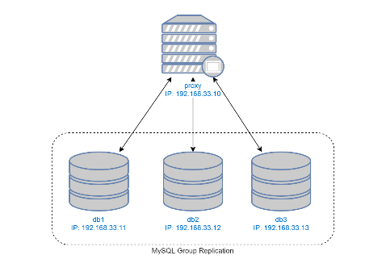

# MySQL Cluster & ProxySQL

#### 05111540000119 - Cahya Putra Hikmawan
##### https://github.com/cphikmawan/database-distributed-courses

### Outline
[1. Tujuan](#1-tujuan)

[2. Arsitektur Sistem](#2-arsitektur-sistem)

- [2.1 - MySQL Cluster](#21-mysql-cluster)
- [2.2 - ProxySQL](#22-proxysql)

[3. Deployment & Testing](#3-deployment-and-testing)

- [3.1 - Vagrant](#31-vagrant)
- [3.2 - Provisioning](#32-provisioning)
- [3.3 - Testing](#33-testing)

### 1. Tujuan
Pada tugas ini, mahasiswa diharapkan mampu untuk

1. Membuat server basis data terdistribusi dengan menggunakan konsep group replication

2. Mampu menambahkan load balancer (ProxySQL) untuk membagi request ke server basis data

3. Menambahkan aplikasi CMS (Wordpress) yang memanfaatkan arsitektur tersebut

4. Menguji kehandalan sistem (testing) dengan menyimulasikan matinya beberapa node dan menunjukkan bahwa data tetap tereplikasi pada node-node server basis data.

### 2. Arsitektur Sistem

#### 2.1 MySQL Cluster
| Sistem Operasi | MySQL Server | Konfigurasi DB |
| --- | --- | --- |
| Ubuntu 16.04 | mysql-common_5.7.23  | cluster_bootstrap.sql: melakukan bootstrapping MySQL group replication |
|| mysql-community-client_5.7.23 | cluster_member.sql: melakukan konfigurasi group replication pada node yang lain |
|| mysql-client_5.7.23 | addition_to_sys.sql: patch script untuk ProxySQL |
|| mysql-community-server_5.7.23 | create_proxysql_user.sql: create user untuk ProxySQL (‘monitor’ untuk monitoring, ‘playgrounduser’ untuk contoh aplikasi) |

#### 2.2 ProxySQL
| Sistem Operasi | MySQL Client | Konfigurasi DB |
| --- | --- | --- |
| Ubuntu 16.04 | mysql-common_5.7.23 | proxysql.sql: |
|| mysql-community-client_5.7.23 | mengubah user admin ProxySQL, menambahkan user ‘monitoring’ |
|| mysql-client_5.7.23 | menambahkan node MySQL, menambahkan user ‘playground’ |

### 3. Deployment and Testing
#### 3.1 Vagrant

#### 3.2 Provisioning

#### 3.3 Testing
