# MySQL Cluster & ProxySQL


#### 05111540000119 - Cahya Putra Hikmawan
##### https://github.com/cphikmawan/database-distributed-courses

### Outline
[1. Tujuan](#1-tujuan)

[2. Arsitektur Sistem](#2-arsitektur-sistem)

- [2.1 - MySQL Cluster](#21-mysql-cluster)
- [2.2 - ProxySQL](#22-proxysql)

[3. Deployment & Testing](#3-deployment-and-testing)

- [3.1 - Vagrant](#31-vagrant)
- [3.2 - Provisioning](#32-provisioning)
- [3.3 - Testing](#33-testing)

### 1. Tujuan


### 2. Arsitektur Sistem
#### 2.1 MySQL Cluster
|||
| --- | --- |
| Sistem Operasi | Ubuntu 18.04.1 LTS |
| Versi MySQL | 5.7.23 |
| RAM | 8 GB |
| CPU | 4 Core |

| No | Host | IP Address |
| --- | --- | --- |
| 1 | db1 | 192.168.33.11 |
| 2 | db2 | 192.168.33.12 |
| 3 | db3 | 192.168.33.13 |

#### 2.2 ProxySQL

| No | Host | IP Address |
| --- | --- | --- |
| 1 | proxy | 192.168.33.10 |

### 3. Deployment and Testing
#### 3.1 Vagrant
##### Prep - Install VirtualBox & Vagrant
```sh
$ sudo apt install vagrant
$ sudo apt install virtualbox
```

##### Step 1 - Download Template
Unzip mysql-cluster-proxysql.zip
```sh
$ unzip mysql-cluster-proxysql.zip
$ cd mysql-cluster-proxysql
```

##### Step 2 - Run Vagrantfile
> **INFO: Direkomendasikan untuk melakukan _vagrant up_ setelah edit _provisioning_ dan persiapan lainnya.**

```sh
$ vagrant up
```

> Jika langsung melakukan **_vagrant up_** Maka akan muncul beberapa kemungkinan **_error_** yaitu: :
> 1. Muncul _**/vagrant/* no such file or directory**_
> 2. Interface **_error_**
> 3. **_Memory_** tidak memenuhi

> Bagaimana cara mengatasinya? (edit Vagrantfile)
> 1. Sinkronisasi folder **_config.vm.synced_folder ".", "/vagrant"_**
> 2. Edit Interface **_node.vm.network "public_network", bridge: "enp2s0"_** (dalam kasus ini interface pada pc yang digunakan yaitu **_enp2s0_**)
> 3. Ubah **_vb.memory = "512_"**

- [Vagrantfile](my-vagrant/Vagrantfile) - Edit Vagrantfile sesuai penjelasan di atas
```rb
# -*- mode: ruby -*-
# vi: set ft=ruby :

# All Vagrant configuration is done below. The "2" in Vagrant.configure
# configures the configuration version (we support older styles for
# backwards compatibility). Please don't change it unless you know what
# you're doing.

Vagrant.configure("2") do |config|
  # sinkronisasi folder
  config.vm.synced_folder ".", "/vagrant"
  # MySQL Cluster dengan 3 node
  (1..3).each do |i|
    config.vm.define "db#{i}" do |node|
      node.vm.hostname = "db#{i}"
      node.vm.box = "bento/ubuntu-16.04"
      node.vm.network "private_network", ip: "192.168.33.1#{i}"

      # Opsional. Edit sesuai dengan nama network adapter di komputer
      node.vm.network "public_network", bridge: "enp2s0"
      node.vm.provider "virtualbox" do |vb|
        vb.name = "db#{i}"
        vb.gui = false
        vb.memory = "512"
      end
  
      node.vm.provision "shell", path: "deployMySQL1#{i}.sh", privileged: false
    end
  end

  config.vm.define "proxy" do |proxy|
    proxy.vm.hostname = "proxy"
    proxy.vm.box = "bento/ubuntu-16.04"
    proxy.vm.network "private_network", ip: "192.168.33.10"
    proxy.vm.network "public_network",  bridge: "enp2s0"
    
    proxy.vm.provider "virtualbox" do |vb|
      vb.name = "proxy"
      vb.gui = false
      vb.memory = "512"
    end

    proxy.vm.provision "shell", path: "deployProxySQL.sh", privileged: false
  end

end
```

#### 3.2 Provisioning
- Ada 4 tahap provisioning yang dilakukan yaitu :
1. Provisioning pada host _db1_ (tanpa modifikasi)
1. Provisioning pada host _db2_ (tanpa modifikasi)
1. Provisioning pada host _db3_ (tanpa modifikasi)
1. Provisioning pada host _proxy_ (dengan modifikasi)

##### Step 1 - Provisioning pada host _db1_
- [deployMySQL11.sh](my-vagrant/deployMySQL11.sh)
```sh
sudo apt-get update
sudo apt-get install libaio1
sudo apt-get install libmecab2
curl -OL https://dev.mysql.com/get/Downloads/MySQL-5.7/mysql-common_5.7.23-1ubuntu16.04_amd64.deb
curl -OL https://dev.mysql.com/get/Downloads/MySQL-5.7/mysql-community-client_5.7.23-1ubuntu16.04_amd64.deb
curl -OL https://dev.mysql.com/get/Downloads/MySQL-5.7/mysql-client_5.7.23-1ubuntu16.04_amd64.deb
curl -OL https://dev.mysql.com/get/Downloads/MySQL-5.7/mysql-community-server_5.7.23-1ubuntu16.04_amd64.deb
sudo debconf-set-selections <<< 'mysql-community-server mysql-community-server/root-pass password admin'
sudo debconf-set-selections <<< 'mysql-community-server mysql-community-server/re-root-pass password admin'
sudo dpkg -i mysql-common_5.7.23-1ubuntu16.04_amd64.deb
sudo dpkg -i mysql-community-client_5.7.23-1ubuntu16.04_amd64.deb
sudo dpkg -i mysql-client_5.7.23-1ubuntu16.04_amd64.deb
sudo dpkg -i mysql-community-server_5.7.23-1ubuntu16.04_amd64.deb
sudo ufw allow 33061
sudo ufw allow 3306
sudo cp /vagrant/my11.cnf /etc/mysql/my.cnf
sudo service mysql restart
sudo mysql -u root -padmin < /vagrant/cluster_bootstrap.sql
sudo mysql -u root -padmin < /vagrant/addition_to_sys.sql
sudo mysql -u root -padmin < /vagrant/create_proxysql_user.sql
```

bash scripting tidak ada yang dimodifikasi, namun kita harus memodifikasi pada bagian **cluster_bootstrap.sql** & **create_proxysql_user.sql**

- [cluster_bootstrap.sql](my-vagrant/cluster_bootstrap.sql) - Membuat database **wordpress**
```sql
SET SQL_LOG_BIN=0;
CREATE USER 'repl'@'%' IDENTIFIED BY 'password' REQUIRE SSL;
GRANT REPLICATION SLAVE ON *.* TO 'repl'@'%';
FLUSH PRIVILEGES;
SET SQL_LOG_BIN=1;
CHANGE MASTER TO MASTER_USER='repl', MASTER_PASSWORD='password' FOR CHANNEL 'group_replication_recovery';
INSTALL PLUGIN group_replication SONAME 'group_replication.so';

SET GLOBAL group_replication_bootstrap_group=ON;
START GROUP_REPLICATION;
SET GLOBAL group_replication_bootstrap_group=OFF;

CREATE DATABASE wordpress;
CREATE DATABASE playground;
CREATE TABLE playground.equipment ( id INT NOT NULL AUTO_INCREMENT, type VARCHAR(50), quant INT, color VARCHAR(25), PRIMARY KEY(id));
INSERT INTO playground.equipment (type, quant, color) VALUES ("slide", 2, "blue");
```

- [create_proxysql_user.sql](my-vagrant/create_proxysql_user.sql) - Membuat user **wordpress**
```sql
CREATE USER 'monitor'@'%' IDENTIFIED BY 'monitorpassword';
GRANT SELECT on sys.* to 'monitor'@'%';
FLUSH PRIVILEGES;

CREATE USER 'playgrounduser'@'%' IDENTIFIED BY 'playgroundpassword';
GRANT ALL PRIVILEGES on playground.* to 'playgrounduser'@'%';
FLUSH PRIVILEGES;

CREATE USER 'wordpress'@'%' IDENTIFIED BY 'wordpress';
GRANT ALL PRIVILEGES on wordpress.* to 'wordpress'@'%';
FLUSH PRIVILEGES;
```

##### Step 2 - Provisioning pada host _db2_
- [deployMySQL12.sh](my-vagrant/deployMySQL12.sh)
```sh
sudo apt-get update
sudo apt-get install libaio1
sudo apt-get install libmecab2
curl -OL https://dev.mysql.com/get/Downloads/MySQL-5.7/mysql-common_5.7.23-1ubuntu16.04_amd64.deb
curl -OL https://dev.mysql.com/get/Downloads/MySQL-5.7/mysql-community-client_5.7.23-1ubuntu16.04_amd64.deb
curl -OL https://dev.mysql.com/get/Downloads/MySQL-5.7/mysql-client_5.7.23-1ubuntu16.04_amd64.deb
curl -OL https://dev.mysql.com/get/Downloads/MySQL-5.7/mysql-community-server_5.7.23-1ubuntu16.04_amd64.deb
sudo debconf-set-selections <<< 'mysql-community-server mysql-community-server/root-pass password admin'
sudo debconf-set-selections <<< 'mysql-community-server mysql-community-server/re-root-pass password admin'
sudo dpkg -i mysql-common_5.7.23-1ubuntu16.04_amd64.deb
sudo dpkg -i mysql-community-client_5.7.23-1ubuntu16.04_amd64.deb
sudo dpkg -i mysql-client_5.7.23-1ubuntu16.04_amd64.deb
sudo dpkg -i mysql-community-server_5.7.23-1ubuntu16.04_amd64.deb
sudo ufw allow 33061
sudo ufw allow 3306
sudo cp /vagrant/my12.cnf /etc/mysql/my.cnf
sudo service mysql restart
sudo mysql -u root -padmin < /vagrant/cluster_member.sql
```

##### Step 3 - Provisioning pada host _db3_
- [deployMySQL13.sh](my-vagrant/deployMySQL13.sh)
```sh
sudo apt-get update
sudo apt-get install libaio1
sudo apt-get install libmecab2
curl -OL https://dev.mysql.com/get/Downloads/MySQL-5.7/mysql-common_5.7.23-1ubuntu16.04_amd64.deb
curl -OL https://dev.mysql.com/get/Downloads/MySQL-5.7/mysql-community-client_5.7.23-1ubuntu16.04_amd64.deb
curl -OL https://dev.mysql.com/get/Downloads/MySQL-5.7/mysql-client_5.7.23-1ubuntu16.04_amd64.deb
curl -OL https://dev.mysql.com/get/Downloads/MySQL-5.7/mysql-community-server_5.7.23-1ubuntu16.04_amd64.deb
sudo debconf-set-selections <<< 'mysql-community-server mysql-community-server/root-pass password admin'
sudo debconf-set-selections <<< 'mysql-community-server mysql-community-server/re-root-pass password admin'
sudo dpkg -i mysql-common_5.7.23-1ubuntu16.04_amd64.deb
sudo dpkg -i mysql-community-client_5.7.23-1ubuntu16.04_amd64.deb
sudo dpkg -i mysql-client_5.7.23-1ubuntu16.04_amd64.deb
sudo dpkg -i mysql-community-server_5.7.23-1ubuntu16.04_amd64.deb
sudo ufw allow 33061
sudo ufw allow 3306
sudo cp /vagrant/my13.cnf /etc/mysql/my.cnf
sudo service mysql restart
sudo mysql -u root -padmin < /vagrant/cluster_member.sql
```

##### Step 4 - Provisioning pada host _proxy_
- [deployProxySQL.sh](my-vagrant/deployProxySQL.sh)
```sh
sudo apt-get update
cd /tmp
curl -OL https://github.com/sysown/proxysql/releases/download/v1.4.4/proxysql_1.4.4-ubuntu16_amd64.deb
curl -OL https://dev.mysql.com/get/Downloads/MySQL-5.7/mysql-common_5.7.23-1ubuntu16.04_amd64.deb
curl -OL https://dev.mysql.com/get/Downloads/MySQL-5.7/mysql-community-client_5.7.23-1ubuntu16.04_amd64.deb
curl -OL https://dev.mysql.com/get/Downloads/MySQL-5.7/mysql-client_5.7.23-1ubuntu16.04_amd64.deb

sudo apt-get install libaio1
sudo apt-get install libmecab2
sudo dpkg -i proxysql_1.4.4-ubuntu16_amd64.deb
sudo dpkg -i mysql-common_5.7.23-1ubuntu16.04_amd64.deb
sudo dpkg -i mysql-community-client_5.7.23-1ubuntu16.04_amd64.deb
sudo dpkg -i mysql-client_5.7.23-1ubuntu16.04_amd64.deb

#install apache
sudo apt-get install -y apache2
sudo systemctl start apache2

#install php and related modules
sudo apt-get install -y php7.0 libapache2-mod-php7.0 php7.0-mysql php7.0-curl php7.0-mbstring php7.0-gd php7.0-xml php7.0-xmlrpc php7.0-intl php7.0-soap php7.0-zip

# install wordpress
cd /tmp
wget -c http://wordpress.org/latest.tar.gz
tar -xzvf latest.tar.gz
sudo mv wordpress/* /var/www/html
sudo cp /vagrant/wp-config.php /var/www/html/
sudo chown -R www-data:www-data /var/www/html/
sudo chmod -R 755 /var/www/html/
sudo mv /var/www/html/index.html /var/www/html/index.html.bak
sudo systemctl restart apache2

sudo ufw allow 33061
sudo ufw allow 3306

sudo systemctl start proxysql
#mysql -u admin -padmin -h 127.0.0.1 -P 6032 < /vagrant/proxysql.sql
```

> **_Keterangan_**
> 1. Modifikasi install apache 
> 2. Modifikasi install php
> 3. Modifikasi install wordpress
> 4. Menambahkan file [**_wp-config.php_**](my-vagrant/wp-config.php)

- [wp-config.php](my-vagrant/wp-config.php)
```php
<?php
/**
 * The base configuration for WordPress
 *
 * The wp-config.php creation script uses this file during the
 * installation. You don't have to use the web site, you can
 * copy this file to "wp-config.php" and fill in the values.
 *
 * This file contains the following configurations:
 *
 * * MySQL settings
 * * Secret keys
 * * Database table prefix
 * * ABSPATH
 *
 * @link https://codex.wordpress.org/Editing_wp-config.php
 *
 * @package WordPress
 */

// ** MySQL settings - You can get this info from your web host ** //
/** The name of the database for WordPress */
define('DB_NAME', 'wordpress');

/** MySQL database username */
define('DB_USER', 'wordpress');

/** MySQL database password */
define('DB_PASSWORD', 'wordpress');

/** MySQL hostname */
define('DB_HOST', '192.168.33.10:6033');

/** Database Charset to use in creating database tables. */
define('DB_CHARSET', 'utf8');

/** The Database Collate type. Don't change this if in doubt. */
define('DB_COLLATE', '');

/**#@+
 * Authentication Unique Keys and Salts.
 *
 * Change these to different unique phrases!
 * You can generate these using the {@link https://api.wordpress.org/secret-key/1.1/salt/ WordPress.org secret-key service}
 * You can change these at any point in time to invalidate all existing cookies. This will force all users to have to log in again.
 *
 * @since 2.6.0
 */
define('AUTH_KEY',         'put your unique phrase here');
define('SECURE_AUTH_KEY',  'put your unique phrase here');
define('LOGGED_IN_KEY',    'put your unique phrase here');
define('NONCE_KEY',        'put your unique phrase here');
define('AUTH_SALT',        'put your unique phrase here');
define('SECURE_AUTH_SALT', 'put your unique phrase here');
define('LOGGED_IN_SALT',   'put your unique phrase here');
define('NONCE_SALT',       'put your unique phrase here');

/**#@-*/

/**
 * WordPress Database Table prefix.
 *
 * You can have multiple installations in one database if you give each
 * a unique prefix. Only numbers, letters, and underscores please!
 */
$table_prefix  = 'wp_';

/**
 * For developers: WordPress debugging mode.
 *
 * Change this to true to enable the display of notices during development.
 * It is strongly recommended that plugin and theme developers use WP_DEBUG
 * in their development environments.
 *
 * For information on other constants that can be used for debugging,
 * visit the Codex.
 *
 * @link https://codex.wordpress.org/Debugging_in_WordPress
 */
define('WP_DEBUG', false);

/* That's all, stop editing! Happy blogging. */

/** Absolute path to the WordPress directory. */
if ( !defined('ABSPATH') )
	define('ABSPATH', dirname(__FILE__) . '/');

/** Sets up WordPress vars and included files. */
require_once(ABSPATH . 'wp-settings.php');

```

##### Finishing
1. Setelah melakukan modifikasi seperti di atas, jalankan **_vagrant up_**
```sh
$ vagrant up
```

2. Modifikasi **_proxysql.sql_**
- [proxysql.sql](my-vagrant/proxysql.sql) - Modifikasi tambah user **_wordpress_** pada ProxySQL
```sql
UPDATE global_variables SET variable_value='admin:password' WHERE variable_name='admin-admin_credentials';
LOAD ADMIN VARIABLES TO RUNTIME;
SAVE ADMIN VARIABLES TO DISK;

UPDATE global_variables SET variable_value='monitor' WHERE variable_name='mysql-monitor_username';
LOAD MYSQL VARIABLES TO RUNTIME;
SAVE MYSQL VARIABLES TO DISK;

INSERT INTO mysql_group_replication_hostgroups (writer_hostgroup, backup_writer_hostgroup, reader_hostgroup, offline_hostgroup, active, max_writers, writer_is_also_reader, max_transactions_behind) VALUES (2, 4, 3, 1, 1, 3, 1, 100);

INSERT INTO mysql_servers(hostgroup_id, hostname, port) VALUES (2, '192.168.33.11', 3306);
INSERT INTO mysql_servers(hostgroup_id, hostname, port) VALUES (2, '192.168.33.12', 3306);
INSERT INTO mysql_servers(hostgroup_id, hostname, port) VALUES (2, '192.168.33.13', 3306);

LOAD MYSQL SERVERS TO RUNTIME;
SAVE MYSQL SERVERS TO DISK;

INSERT INTO mysql_users(username, password, default_hostgroup) VALUES ('playgrounduser', 'playgroundpassword', 2);
INSERT INTO mysql_users(username, password, default_hostgroup) VALUES ('wordpress', 'wordpress', 2);
LOAD MYSQL USERS TO RUNTIME;
SAVE MYSQL USERS TO DISK;
```

3. Jalankan perintah berikut untuk provisioning ProxySQL
```sh
$ vagrant ssh proxy
$ mysql -u admin -p -h 127.0.0.1 -P 6032 < /vagrant/proxysql.sql
```

> Kenapa provision untuk proxysql.sql dilakukan manual dan tidak ditaruh pada file **_deployProxySQL.sh_** ?

> Karena ketika akan menjalankan provisioning diperlukannya koneksi ke database dengan user admin, namun user admin hanya diperbolehkan akses hanya dari koneksi lokalnya saja

3. Konfigurasi dan Installasi Wordpress
- Akses **_IP ProxySQL_** pada browser http://192.168.33.10
- Maka akan muncul gambar sebagai berikut :

1. Pilih Bahasa

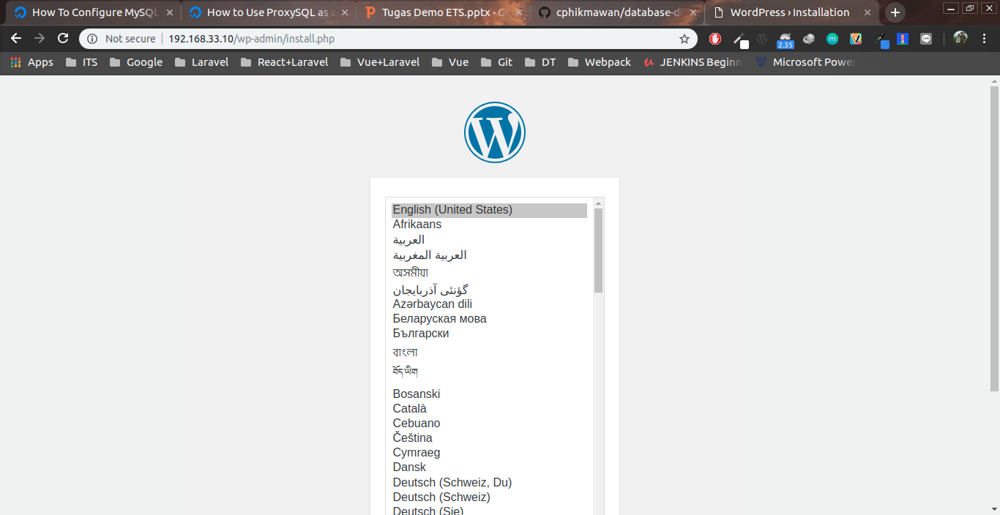

2. Input Judul dan Membuat Akun

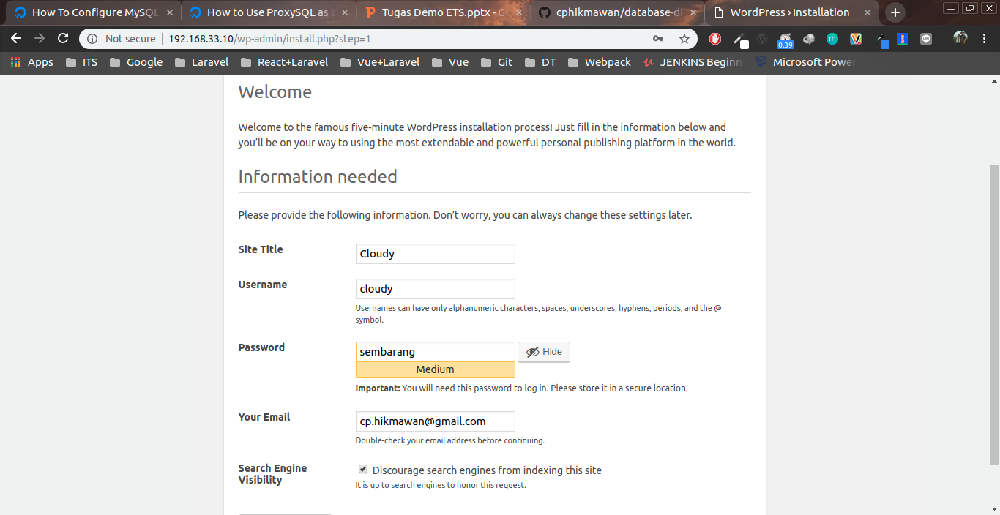

3. Informasi Status

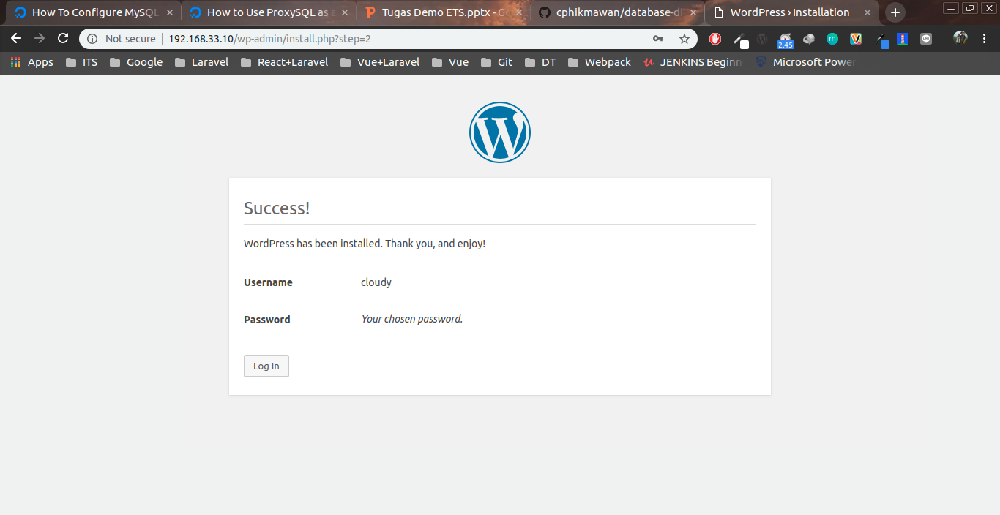

4. Login Form

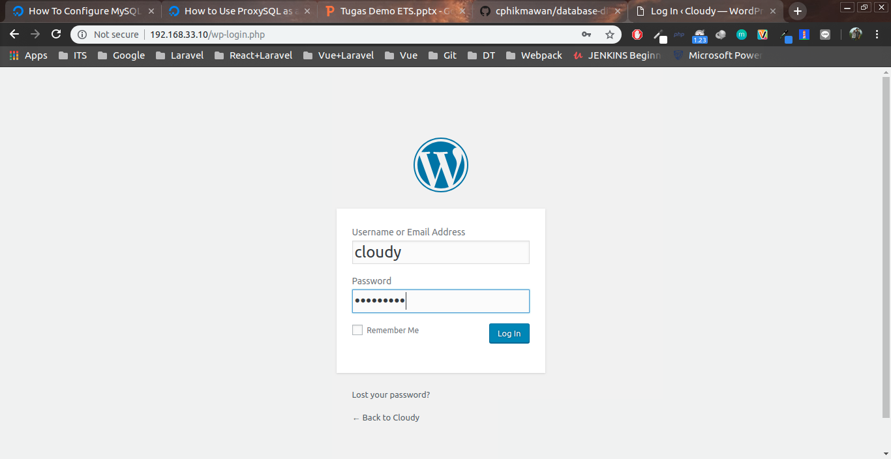

5. Dashboard

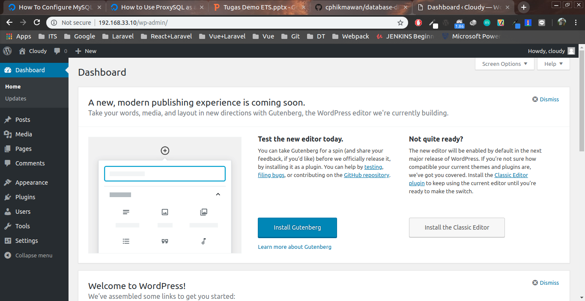

6. Dashboard

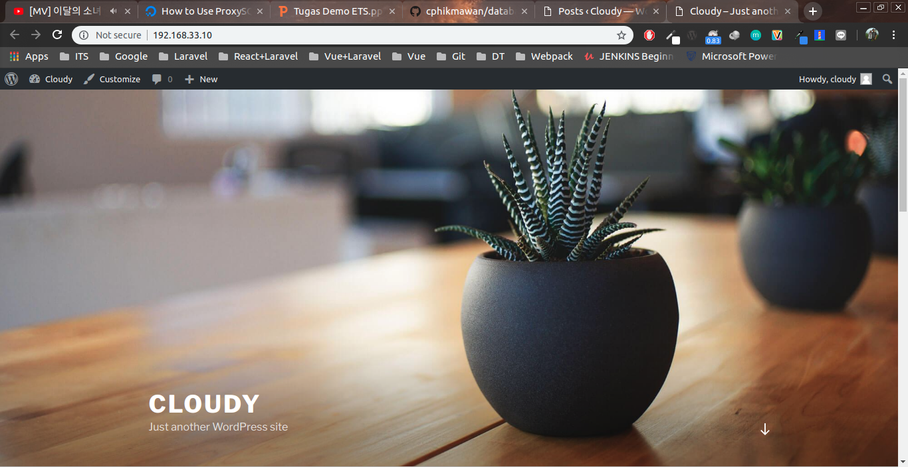

#### 3.3 Testing
##### 1. Tes Koneksi
- Step 1 - Pastikan bisa SSH ke semua host
```sh
$ vagrant ssh [nama_host]
```
> [namahost] = db1, db2, db3 atau proxy

contoh :
```sh
$ vagrant ssh db1
$ vagrant ssh db2
$ vagrant ssh db3
$ vagrant ssh proxy
```
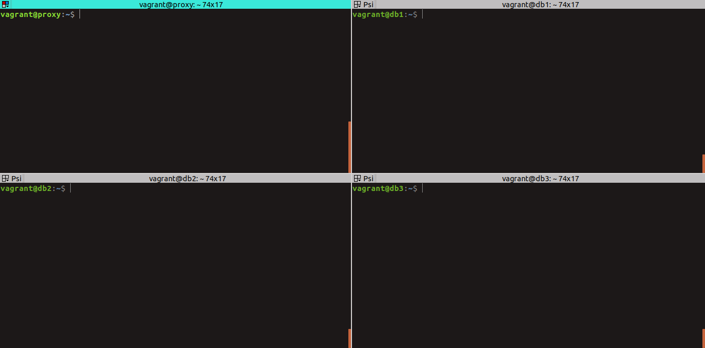

- Step 2 - Pastikan user dapat melakukan koneksi ke Group MySQL dari ProxySQL
```sh
$ mysql -u playgrounduser -p -h 127.0.0.1 -P 6033 --prompt='ProxySQLClient> '
```
> password: playgroundpassword

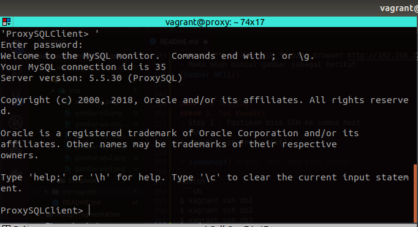

##### 2. Tes Replikasi
- Untuk tes replikasi bisa dilakukan dengan :
1. Cek pada group replication
2. Lakukan CRUD pada salah satu DB

Lebih gampangnya pada step membuat akun pada CMS **_Wordpress_** maka akan otomatis terbuat pada semua host, berikut buktinya :
- Step 1 - Login ke MySQL pada Group Replication Host
```sh
$ mysql -uroot -padmin
```

- Step 2 - Login ke MySQL pada ProxySQL menggunakan user **wordpress**
```sh
$ mysql -u wordpress -p -h 127.0.0.1 -P 6033 --prompt='ProxySQLClient> '
# password: wordpress
```

- Step 3 - Lakukan query
```sql
mysql> select * from wordpress.wp_users;
```
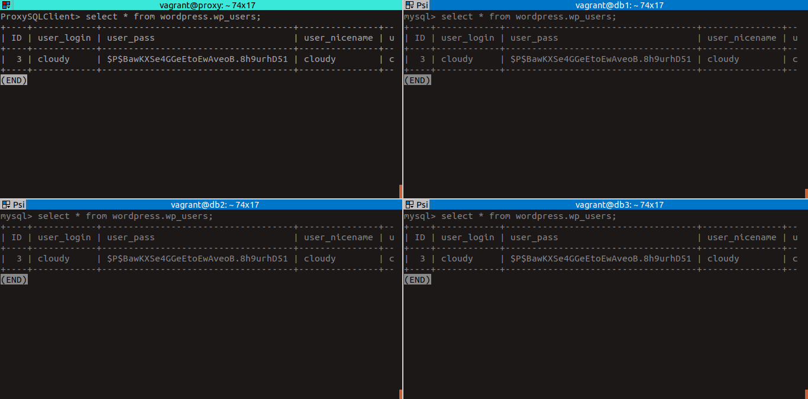

##### 3. Tes ProxySQL
- Step 1 - Matikan salah satu node MySQL Server (db1, db2 atau db3)
1. Pada host **_db3_**
```sh
(db3) $ sudo systemctl stop mysql
```
2. Cek pada host **_db3_**
```sh
(db3) $ sudo systemctl status mysql
```
3. Cek pada ProxySQL admin
```sql
mysql> SELECT hostgroup_id, hostname, status FROM runtime_mysql_servers;
```

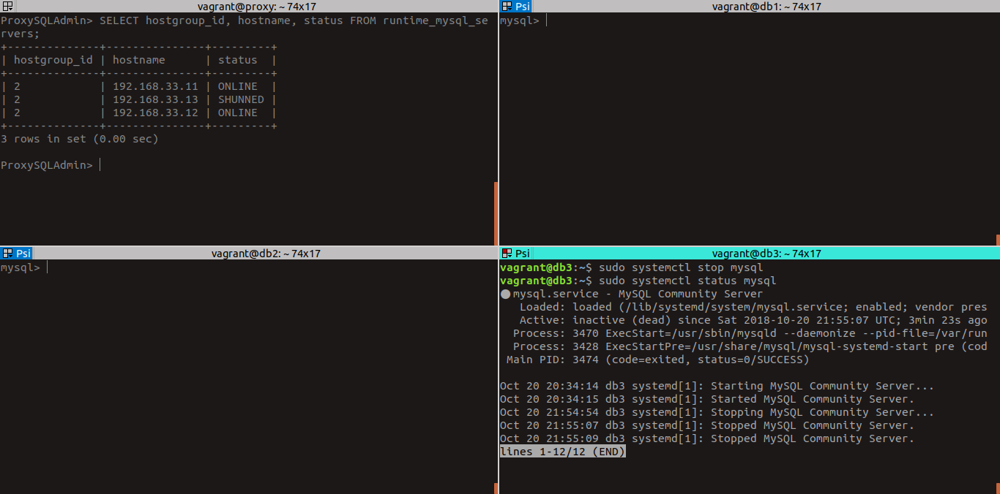

- Step 2 - Coba Posting

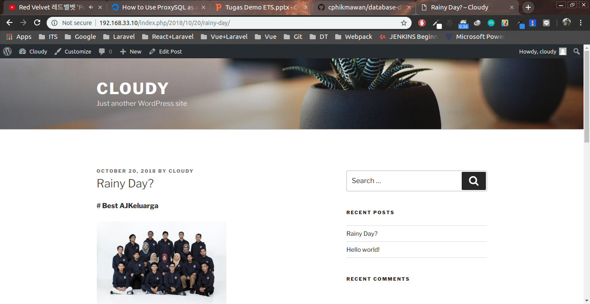

- Step 3 - Nyalakan node yang dimatikan
1. Pada host **_db3_**
```sh
$ sudo systemctl start mysql
```

- Step 4 - Cek post berhasil direplikasi atau tidak
```sql
mysql> select * from wp_posts;
```

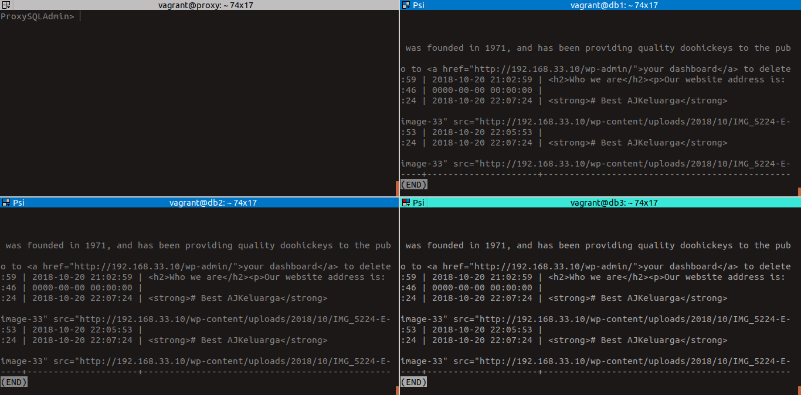

Sekian.