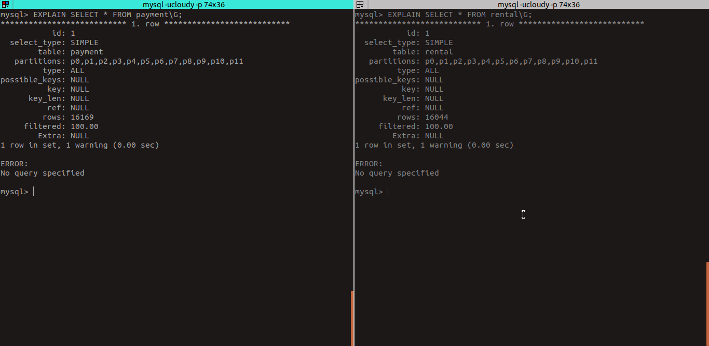
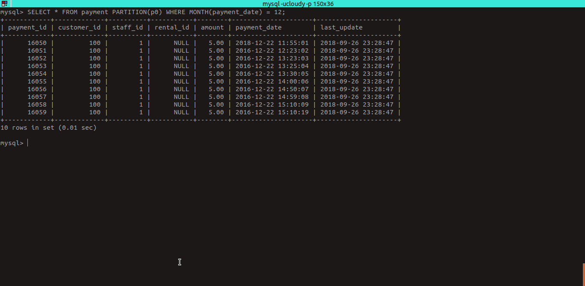
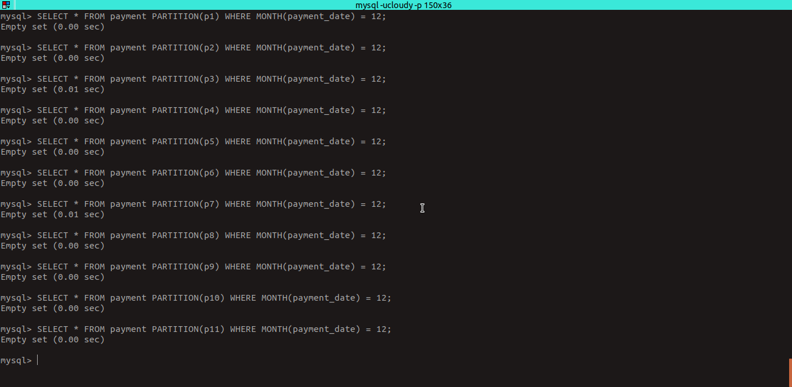

# Partisi Basis Data

#### 05111540000119 - Cahya Putra Hikmawan
##### https://github.com/cphikmawan/database-distributed-courses

### Outline
[1. Deskripsi Server](#1-deskripsi-server)

[2. Implementasi Partisi 1: Sakila DB](#2-implementasi-partisi-1-sakila-db)

- [2.1 - Deskripsi Dataset](#21-deskripsi-dataset)
- [2.2 - Proses Pembuatan Partisi](#22-proses-pembuatan-partisi)
- [2.3 - Benchmarking](#23-benchmarking)

[3. Implementasi Partisi 2: Measures Dataset](#3-implementasi-partisi-2-measures-dataset)

- [3.1 - Deskripsi Dataset](#31-deskripsi-dataset)
- [3.2 - Import Dataset](#32-import-dataset)
- [3.3 - Benchmarking](#33-benchmarking)

[Kesimpulan](#kesimpulan)

### 1. Deskripsi Server
|||
| --- | --- |
| Sistem Operasi | Ubuntu 18.04.1 LTS |
| Versi MySQL | 5.7.23 |
| RAM | 8 GB |
| CPU | 4 Core |

### 2. Implementasi Partisi 1: Sakila DB
#### 2.1 Deskripsi Dataset
Import [sakila-db](assets/sakila-db "Sakila DB") :
```sh
mysql -ucloudy -p < sakila-schema.sql
```
```sh
mysql -ucloudy -p < sakila-data.sql
```
- Dataset ini terdiri dari 23 tabel
```SQL
SELECT TABLE_NAME, TABLE_ROWS FROM INFORMATION_SCHEMA.TABLES WHERE TABLE_SCHEMA = 'sakila' ORDER BY TABLE_ROWS DESC;
```
- Masing-masing tabel memiliki jumlah baris data sebagai berikut :

| TABLE_NAME | TABLE_ROWS |
| --- | --- |
| payment | 16049 |
| rental | 16044 |
| film_actor | 5462 |
| inventory | 4581 |
| film | 1000 |
| film_text | 1000 |
| film_category | 1000 |
| address | 603 |
| city | 600 |
| customer | 599 |
| actor | 200 |
| country | 109 |
| category | 16 |
| language | 6 |
| store | 2 |
| staff | 2 |
| nicer_but_slower_film_list | NULL |
| customer_list | NULL |
| staff_list | NULL |
| sales_by_store | NULL |
| actor_info | NULL |
| sales_by_film_category | NULL |
| film_list | NULL |

#### 2.2 Proses Pembuatan Partisi 
- Pemilihan tabel yang akan dipartisi
    - Bagaimana cara pemilihan tabel yang akan dibuat partisi?
    Pemilihan tabel yang akan dipartisi ditentukan oleh jumlah data yang paling banyak dan memiliki peluang akan bertambah secara berkala.
- Daftar tabel yang akan dipartisi
    - Tabel Payment
    - Tabel Rental

##### Tabel Payment
- Jenis partisi yang digunakan: **HASH**
- Sehingga tidak memerlukan syarat/predikat.
- Tabel akan dipartisi menjadi **12** bagian yaitu :
    - p0 = Berisi data dengan bulan pada *__payment_date__* = 12
    - p1 = Berisi data dengan bulan pada *__payment_date__* = 1
    - p2 = Berisi data dengan bulan pada *__payment_date__* = 2
    - p3 = Berisi data dengan bulan pada *__payment_date__* = 3
    - p4 = Berisi data dengan bulan pada *__payment_date__* = 4
    - p5 = Berisi data dengan bulan pada *__payment_date__* = 5
    - p6 = Berisi data dengan bulan pada *__payment_date__* = 6
    - p7 = Berisi data dengan bulan pada *__payment_date__* = 7
    - p8 = Berisi data dengan bulan pada *__payment_date__* = 8
    - p9 = Berisi data dengan bulan pada *__payment_date__* = 9
    - p10 = Berisi data dengan bulan pada *__payment_date__* = 10
    - p11 = Berisi data dengan bulan pada *__payment_date__* = 11

> Sistem Partisi HASH yaitu *mod n* partisi

##### Tabel Rental
- Jenis partisi yang digunakan: **HASH**
- Sehingga, tidak memerlukan syarat/predikat.
- Tabel akan dipartisi menjadi **12** bagian yaitu :
    - p0 = Berisi data dengan bulan pada *__rental_date__* = 12
    - p1 = Berisi data dengan bulan pada *__rental_date__* = 1
    - p2 = Berisi data dengan bulan pada *__rental_date__* = 2
    - p3 = Berisi data dengan bulan pada *__rental_date__* = 3
    - p4 = Berisi data dengan bulan pada *__rental_date__* = 4
    - p5 = Berisi data dengan bulan pada *__rental_date__* = 5
    - p6 = Berisi data dengan bulan pada *__rental_date__* = 6
    - p7 = Berisi data dengan bulan pada *__rental_date__* = 7
    - p8 = Berisi data dengan bulan pada *__rental_date__* = 8
    - p9 = Berisi data dengan bulan pada *__rental_date__* = 9
    - p10 = Berisi data dengan bulan pada *__rental_date__* = 10
    - p11 = Berisi data dengan bulan pada *__rental_date__* = 11

##### Implementasi Partisi

- Script SQL untuk partisi tabel **payment**
```SQL
CREATE TABLE payment (
  payment_id SMALLINT UNSIGNED NOT NULL AUTO_INCREMENT,
  customer_id SMALLINT UNSIGNED NOT NULL,
  staff_id TINYINT UNSIGNED NOT NULL,
  rental_id INT DEFAULT NULL,
  amount DECIMAL(5,2) NOT NULL,
  payment_date DATETIME NOT NULL,
  last_update TIMESTAMP DEFAULT CURRENT_TIMESTAMP ON UPDATE CURRENT_TIMESTAMP,
  PRIMARY KEY  (payment_id, payment_date),
  KEY idx_fk_staff_id (staff_id),
  KEY idx_fk_customer_id (customer_id)
  -- CONSTRAINT fk_payment_rental FOREIGN KEY (rental_id) REFERENCES rental (rental_id) ON DELETE SET NULL ON UPDATE CASCADE,
  -- CONSTRAINT fk_payment_customer FOREIGN KEY (customer_id) REFERENCES customer (customer_id) ON DELETE RESTRICT ON UPDATE CASCADE,
  -- CONSTRAINT fk_payment_staff FOREIGN KEY (staff_id) REFERENCES staff (staff_id) ON DELETE RESTRICT ON UPDATE CASCADE
)ENGINE=InnoDB DEFAULT CHARSET=utf8;

ALTER TABLE payment PARTITION BY HASH( MONTH(payment_date) ) PARTITIONS 12;
```
- Script SQL untuk partisi tabel **rental**
```SQL
CREATE TABLE rental (
  rental_id INT NOT NULL AUTO_INCREMENT,
  rental_date DATETIME NOT NULL,
  inventory_id MEDIUMINT UNSIGNED NOT NULL,
  customer_id SMALLINT UNSIGNED NOT NULL,
  return_date DATETIME DEFAULT NULL,
  staff_id TINYINT UNSIGNED NOT NULL,
  last_update TIMESTAMP NOT NULL DEFAULT CURRENT_TIMESTAMP ON UPDATE CURRENT_TIMESTAMP,
  PRIMARY KEY (rental_id, rental_date),
  UNIQUE KEY  (rental_date,inventory_id,customer_id),
  KEY idx_fk_inventory_id (inventory_id),
  KEY idx_fk_customer_id (customer_id),
  KEY idx_fk_staff_id (staff_id)
  -- CONSTRAINT fk_rental_staff FOREIGN KEY (staff_id) REFERENCES staff (staff_id) ON DELETE RESTRICT ON UPDATE CASCADE,
  -- CONSTRAINT fk_rental_inventory FOREIGN KEY (inventory_id) REFERENCES inventory (inventory_id) ON DELETE RESTRICT ON UPDATE CASCADE,
  -- CONSTRAINT fk_rental_customer FOREIGN KEY (customer_id) REFERENCES customer (customer_id) ON DELETE RESTRICT ON UPDATE CASCADE
)ENGINE=InnoDB DEFAULT CHARSET=utf8;

ALTER TABLE rental PARTITION BY HASH( MONTH(rental_date) ) PARTITIONS 12;
```

- Cek Partisi
```SQL
EXPLAIN SELECT * FROM payment\G;

EXPLAIN SELECT * FROM rental\G;
```



#### 2.3 Benchmarking
##### Insert data baru
Data yang diinsert masing-masing 10 data per tabel partisi dari **p0** - **p11**.

> Sebelum melakukan insert, hapus/komen *__trigger__* tabel **payment** & **rental** pada file **sakila-data.sql** karena *__trigger__* mempengaruhi ketika ada data masuk **payment_date** atau **rental_date** akan di set **NOW()**

```SQL
CREATE TRIGGER payment_date BEFORE INSERT ON payment
FOR EACH ROW SET NEW.payment_date = NOW();

CREATE TRIGGER rental_date BEFORE INSERT ON rental
FOR EACH ROW SET NEW.rental_date = NOW();
```

- Insert Data Tabel Payment ([insert-payment.sql](assets/sakila-db/insert-payment.sql))
```SQL
INSERT INTO payment (customer_id, staff_id, rental_id, amount, payment_date) values
-- insert data ke partisi p0
(100,1,null,'5','2018-12-22 11:55:01'),
(100,1,null,'5','2016-12-22 12:23:02'),
(100,1,null,'5','2016-12-22 13:23:03'),
(100,1,null,'5','2016-12-22 13:25:04'),
(100,1,null,'5','2016-12-22 13:30:05'),
(100,1,null,'5','2016-12-22 14:00:06'),
(100,1,null,'5','2016-12-22 14:50:07'),
(100,1,null,'5','2016-12-22 14:59:08'),
(100,1,null,'5','2016-12-22 15:10:09'),
(100,1,null,'5','2016-12-22 15:10:19'),
-- insert data ke partisi p1
(101,1,null,'5','2016-01-22 15:10:01'),
(101,1,null,'5','2016-01-22 15:10:02'),
(101,1,null,'5','2016-01-22 15:10:03'),
(101,1,null,'5','2016-01-22 15:10:04'),
(101,1,null,'5','2016-01-22 15:10:05'),
(101,1,null,'5','2016-01-22 15:10:06'),
(101,1,null,'5','2016-01-22 15:10:07'),
(101,1,null,'5','2016-01-22 15:10:08'),
(101,1,null,'5','2016-01-22 15:10:09'),
(101,1,null,'5','2016-01-22 15:10:19'),
-- insert data ke partisi p2
(102,1,null,'5','2016-02-22 15:10:01'),
(102,1,null,'5','2016-02-22 15:10:02'),
(102,1,null,'5','2016-02-22 15:10:03'),
(102,1,null,'5','2016-02-22 15:10:04'),
(102,1,null,'5','2016-02-22 15:10:05'),
(102,1,null,'5','2016-02-22 15:10:06'),
(102,1,null,'5','2016-02-22 15:10:07'),
(102,1,null,'5','2016-02-22 15:10:08'),
(102,1,null,'5','2016-02-22 15:10:09'),
(102,1,null,'5','2016-02-22 15:10:19'),
-- insert data ke partisi p3
(103,1,null,'5','2016-03-22 15:10:01'),
(103,1,null,'5','2016-03-22 15:10:02'),
(103,1,null,'5','2016-03-22 15:10:03'),
(103,1,null,'5','2016-03-22 15:10:04'),
(103,1,null,'5','2016-03-22 15:10:05'),
(103,1,null,'5','2016-03-22 15:10:06'),
(103,1,null,'5','2016-03-22 15:10:07'),
(103,1,null,'5','2016-03-22 15:10:08'),
(103,1,null,'5','2016-03-22 15:10:09'),
(103,1,null,'5','2016-03-22 15:10:19'),
-- insert data ke partisi p4
(104,1,null,'5','2016-04-22 15:10:01'),
(104,1,null,'5','2016-04-22 15:10:02'),
(104,1,null,'5','2016-04-22 15:10:03'),
(104,1,null,'5','2016-04-22 15:10:04'),
(104,1,null,'5','2016-04-22 15:10:05'),
(104,1,null,'5','2016-04-22 15:10:06'),
(104,1,null,'5','2016-04-22 15:10:07'),
(104,1,null,'5','2016-04-22 15:10:08'),
(104,1,null,'5','2016-04-22 15:10:09'),
(104,1,null,'5','2016-04-22 15:10:19'),
-- insert data ke partisi p5
(105,1,null,'5','2016-05-22 15:10:01'),
(105,1,null,'5','2016-05-22 15:10:02'),
(105,1,null,'5','2016-05-22 15:10:03'),
(105,1,null,'5','2016-05-22 15:10:04'),
(105,1,null,'5','2016-05-22 15:10:05'),
(105,1,null,'5','2016-05-22 15:10:06'),
(105,1,null,'5','2016-05-22 15:10:07'),
(105,1,null,'5','2016-05-22 15:10:08'),
(105,1,null,'5','2016-05-22 15:10:09'),
(105,1,null,'5','2016-05-22 15:10:19'),
-- insert data ke partisi p6
(106,1,null,'5','2016-06-22 15:10:01'),
(106,1,null,'5','2016-06-22 15:10:02'),
(106,1,null,'5','2016-06-22 15:10:03'),
(106,1,null,'5','2016-06-22 15:10:04'),
(106,1,null,'5','2016-06-22 15:10:05'),
(106,1,null,'5','2016-06-22 15:10:06'),
(106,1,null,'5','2016-06-22 15:10:07'),
(106,1,null,'5','2016-06-22 15:10:08'),
(106,1,null,'5','2016-06-22 15:10:09'),
(106,1,null,'5','2016-06-22 15:10:19'),
-- insert data ke partisi p7
(107,1,null,'5','2016-07-22 15:10:01'),
(107,1,null,'5','2016-07-22 15:10:02'),
(107,1,null,'5','2016-07-22 15:10:03'),
(107,1,null,'5','2016-07-22 15:10:04'),
(107,1,null,'5','2016-07-22 15:10:05'),
(107,1,null,'5','2016-07-22 15:10:06'),
(107,1,null,'5','2016-07-22 15:10:07'),
(107,1,null,'5','2016-07-22 15:10:08'),
(107,1,null,'5','2016-07-22 15:10:09'),
(107,1,null,'5','2016-07-22 15:10:19'),
-- insert data ke partisi p8
(108,1,null,'5','2016-08-22 15:10:01'),
(108,1,null,'5','2016-08-22 15:10:02'),
(108,1,null,'5','2016-08-22 15:10:03'),
(108,1,null,'5','2016-08-22 15:10:04'),
(108,1,null,'5','2016-08-22 15:10:05'),
(108,1,null,'5','2016-08-22 15:10:06'),
(108,1,null,'5','2016-08-22 15:10:07'),
(108,1,null,'5','2016-08-22 15:10:08'),
(108,1,null,'5','2016-08-22 15:10:09'),
(108,1,null,'5','2016-08-22 15:10:19'),
-- insert data ke partisi p9
(109,1,null,'5','2016-09-22 15:10:01'),
(109,1,null,'5','2016-09-22 15:10:02'),
(109,1,null,'5','2016-09-22 15:10:03'),
(109,1,null,'5','2016-09-22 15:10:04'),
(109,1,null,'5','2016-09-22 15:10:05'),
(109,1,null,'5','2016-09-22 15:10:06'),
(109,1,null,'5','2016-09-22 15:10:07'),
(109,1,null,'5','2016-09-22 15:10:08'),
(109,1,null,'5','2016-09-22 15:10:09'),
(109,1,null,'5','2016-09-22 15:10:19'),
-- insert data ke partisi p10
(110,1,null,'5','2016-10-22 15:10:01'),
(110,1,null,'5','2016-10-22 15:10:02'),
(110,1,null,'5','2016-10-22 15:10:03'),
(110,1,null,'5','2016-10-22 15:10:04'),
(110,1,null,'5','2016-10-22 15:10:05'),
(110,1,null,'5','2016-10-22 15:10:06'),
(110,1,null,'5','2016-10-22 15:10:07'),
(110,1,null,'5','2016-10-22 15:10:08'),
(110,1,null,'5','2016-10-22 15:10:09'),
(110,1,null,'5','2016-10-22 15:10:19'),
-- insert data ke partisi p11
(111,1,null,'5','2016-11-22 15:10:01'),
(111,1,null,'5','2016-11-22 15:10:02'),
(111,1,null,'5','2016-11-22 15:10:03'),
(111,1,null,'5','2016-11-22 15:10:04'),
(111,1,null,'5','2016-11-22 15:10:05'),
(111,1,null,'5','2016-11-22 15:10:06'),
(111,1,null,'5','2016-11-22 15:10:07'),
(111,1,null,'5','2016-11-22 15:10:08'),
(111,1,null,'5','2016-11-22 15:10:09'),
(111,1,null,'5','2016-11-22 15:19:19');
```

##### SELECT data dari partisi(p0) dengan ketentuan *MONTH(payment_date) = 12*
```SQL
SELECT * FROM payment PARTITION(p0) WHERE MONTH(payment_date) = 12;
```


##### SELECT data dari partisi lain (p1 sampai p11) dengan ketentuan *MONTH(payment_date) = 12*
```SQL
SELECT * FROM payment PARTITION(p1) WHERE MONTH(payment_date) = 12;
```


> **Tabel Rental** juga akan mengalami hal yang sama seperti Tabel Payment ketika melakukan **INSERT** maupun ketika **Benchmarking**

### 3. Implementasi Partisi 2: Measures Dataset
#### 3.1 Deskripsi Dataset
##### Deskripsi Singkat
Dataset terdiri dari 2 tabel yaitu :
1. Tabel measures
2. Tabel partitioned_measures

##### Sumber Dataset
1. [http://www.vertabelo.com/blog/technical-articles/everything-you-need-to-know-about-mysql-partitions](http://www.vertabelo.com/blog/technical-articles/everything-you-need-to-know-about-mysql-partitions)

2. [From Assets](assets/measure-db)

#### 3.2 Import Dataset
##### Cara Import Dataset
1. Download dataset dari salah satu link diatas
2. Membuat database dari **terminal**
```sh
echo "create database nama_database" | mysql -u username -p
```
> **Contoh** :
> nama_database = measures
> username = cloudy atau username = root

3. Import dataset yang sudah didownload lewat **terminal**
```sh
mysql -u username -p nama_database < [nama_file_dataset].sql
```

> **Contoh** :
> nama_database = measures
> username = cloudy atau username = root
> [nama_file_dataset].sql = measure-dataset.sql


#### 3.3 Benchmarking
##### SELECT Bendhmarking
- Tanpa Partisi
```SQL
SELECT SQL_NO_CACHE
    COUNT(*)
FROM
    measure.measures
WHERE
    measure_timestamp >= '2016-01-01'
        AND DAYOFWEEK(measure_timestamp) = 1;
```
- Dengan Partisi
```SQL
SELECT SQL_NO_CACHE
    COUNT(*)
FROM
    measure.partitioned_measures
WHERE
    measure_timestamp >= '2016-01-01'
        AND DAYOFWEEK(measure_timestamp) = 1;
```

| No | Tanpa Partisi (Detik) | Partisi (Detik) | Rows |
| --- | --- | --- | --- |
| 1 |1.87|0.35|112153|
| 2 |0.71|0.31|112153|
| 3 |0.70|0.32|112153|
| 4 |0.70|0.31|112153|
| 5 |0.71|0.30|112153|
| 6 |0.71|0.31|112153|
| 7 |0.71|0.31|112153|
| 8 |0.71|0.30|112153|
| 9 |0.70|0.30|112153|
| 10 |0.71|0.30|112153|
| **Mean** |**0.823**|**0.311**|**112153**|

##### BIG DELETE Benchmarking
- Tanpa Partisi
```SQL
DELETE
FROM measure.measures
WHERE  measure_timestamp < '2015-01-01';
```
- Dengan Partisi
```SQL
ALTER TABLE measure.partitioned_measures 
DROP PARTITION to_delete_logs ;
```

| No | Tanpa Partisi (Detik) | Partisi (Detik) | Rows |
| --- | --- | --- | --- |
| 1 |0.60|0.58|85314|
| 2 |0.99|0.31|85314|
| 3 |0.78|0.37|85314|
| 4 |0.83|0.37|85314|
| 5 |0.86|0.31|85314|
| 6 |0.69|0.39|85314|
| 7 |1.25|0.36|85314|
| 8 |1.04|0.31|85314|
| 9 |1.14|0.36|85314|
| 10 |1.13|0.33|85314|
| **Mean** |**0.931**|**0.369**|**85314**|

### Kesimpulan
1. Partisi bisa dilakukan dengan banyak metode yaitu **range**, **key**, **hash**, **list**.
2. Dalam kasus ini menggunakan metode HASH dengan n = 12 partisi dan didapatkan hasil kesimpulan sistem HASH yaitu **DATA *mod* n**
3. Dalam kasus **SELECT** pada *Measures Dataset*, tabel yang menggunakan partisi lebih cepat (2 kali) daripada tabel yang tidak dipartisi.
4. Dalam kasus **BIG DELETE** kecepatan query tabel yang menggunakan partisi mendominasi tabel yang tidak dipartisi karena untuk **DROP** tabel partisi cukup untuk **DROP** tabel partisi tersebut dan tidak perlu memilah data lagi.